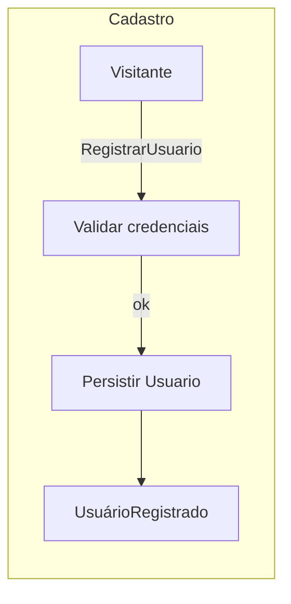
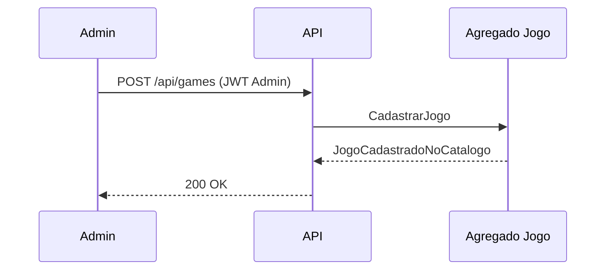
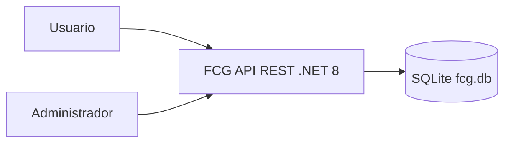
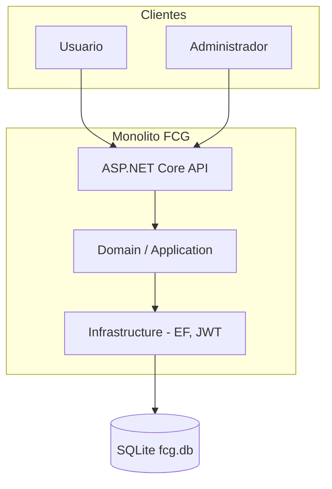
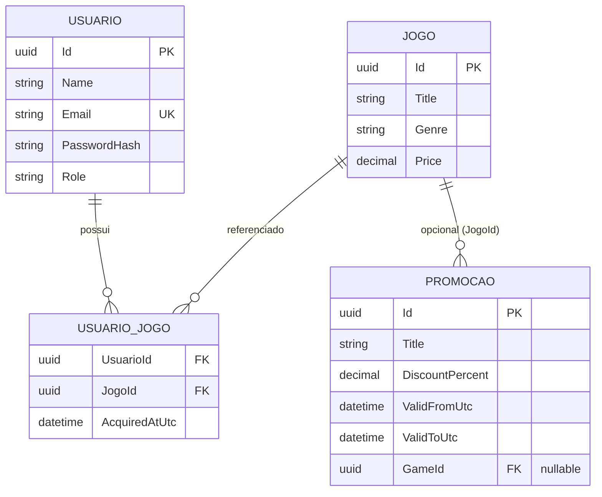

# Documentação DDD — FIAP Cloud Games (FCG) — Fase 1

Este documento substitui ou complementa um board em **Miro** (equivalente aceito pelo enunciado): contém **Event Storming** dos fluxos obrigatórios e **diagramas** alinhados à disciplina de DDD.

---

## 1. Linguagem ubíqua (glossário)

| Termo | Significado |
|--------|-------------|
| **Usuário** | Pessoa cadastrada na plataforma, com perfil `Usuario` ou `Administrador`. |
| **Biblioteca** | Conjunto de jogos **adquiridos** por um usuário (associação usuário–jogo). |
| **Jogo (catálogo)** | Item cadastrado no catálogo, com título, gênero e preço. |
| **Promoção** | Campanha com desconto e vigência; pode estar ligada a um jogo específico ou ser genérica (`GameId` nulo). |
| **Token JWT** | Credencial emitida após login (ou registro) que identifica o usuário e seu perfil. |

---

## 2. Event Storming — fluxo: criação de usuário (cadastro)

Ordem sugerida no quadro (laranja → roxo → verde → amarelo → rosa).

### Eventos de domínio (laranja)

| # | Evento passado |
|---|----------------|
| E1 | **UsuárioRegistrado** |
| E2 | **CredenciaisValidadas** (e-mail e senha conforme política) |
| E3 | **SenhaArmazenadaComHash** |

### Comandos (azul)

| Comando | Dispara |
|---------|---------|
| **RegistrarUsuario** | E1 (após persistência) |

### Atores (amarelo)

- Visitante (anônimo) ou sistema (API).

### Leituras / políticas (rosa)

- Política de **senha forte** e **formato de e-mail** (`CredentialValidation`).
- Política de **e-mail único** no cadastro.

### Agregados envolvidos

- **Usuario** (raiz): invariantes de e-mail único, hash de senha, perfil inicial `Usuario`.

---

## 3. Event Storming — fluxo: criação de jogo (administrador)

### Eventos de domínio (laranja)

| # | Evento |
|---|--------|
| E4 | **JogoCadastradoNoCatalogo** |

### Comandos (azul)

| Comando | Dispara |
|---------|---------|
| **CadastrarJogo** | E4 |

### Atores

- **Administrador** (autorizado por JWT + role).

### Políticas

- Apenas perfil **Administrador** pode executar o comando.
- Título obrigatório; preço não negativo.

### Agregados

- **Jogo** (raiz do catálogo).

---

## 4. Fluxos complementares (resumo Event Storming)

### Login e emissão de JWT

- **Comandos:** AutenticarUsuario  
- **Eventos:** UsuarioAutenticado, TokenEmitido  
- **Políticas:** verificação de hash BCrypt; usuário existente.

### Aquisição na biblioteca

- **Comandos:** AdquirirJogoNaBiblioteca  
- **Eventos:** JogoAdquirido (associação `UsuarioJogo` criada)  
- **Invariantes:** jogo deve existir; não duplicar aquisição.

### Promoção (admin)

- **Comandos:** CriarPromocao  
- **Eventos:** PromocaoCriada  
- **Políticas:** desconto 0–100%; vigência `ValidFromUtc` < `ValidToUtc`; `GameId` opcional e válido se informado.

---

## 5. Diagrama de contexto (visão geral)

> Este diagrama é compatível com a maioria dos renderizadores Mermaid (GitHub, VS Code, etc.).

---

## 6. Diagrama de containers (alternativa compatível)

---

## 7. Modelo de domínio (agregados e relacionamentos)

---

## 8. Como replicar no Miro (opcional)

1. Crie um board com colunas ou áreas: **Eventos** (laranja), **Comandos**, **Atores**, **Agregados**, **Políticas**.  
2. Transfira os eventos das tabelas das seções 2 e 3 como post-its.  
3. Cole os fluxos Mermaid como **print** ou redesenhe com setas entre comandos e eventos.  
4. Inclua o link do Miro no `ENTREGA_RELATORIO_TEMPLATE.txt` (campo “Link da documentação DDD”).

---

## 9. Mapeamento código ↔ DDD

| Conceito | Pasta / artefato |
|----------|------------------|
| Entidades e regras puras | `src/FCG/Domain/` |
| Contratos e DTOs | `src/FCG/Application/` |
| Persistência, JWT, serviços | `src/FCG/Infrastructure/` |
| HTTP | `src/FCG/Controllers/` |
| Tratamento transversal | `src/FCG/Middleware/` |

Este alinhamento segue **monólito modular** com separação por responsabilidade, preparando evoluções futuras (ex.: matchmaking) sem exigir microserviços nesta fase.
